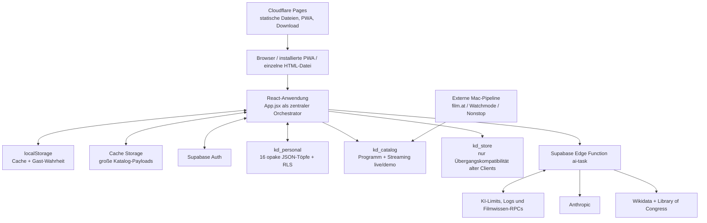
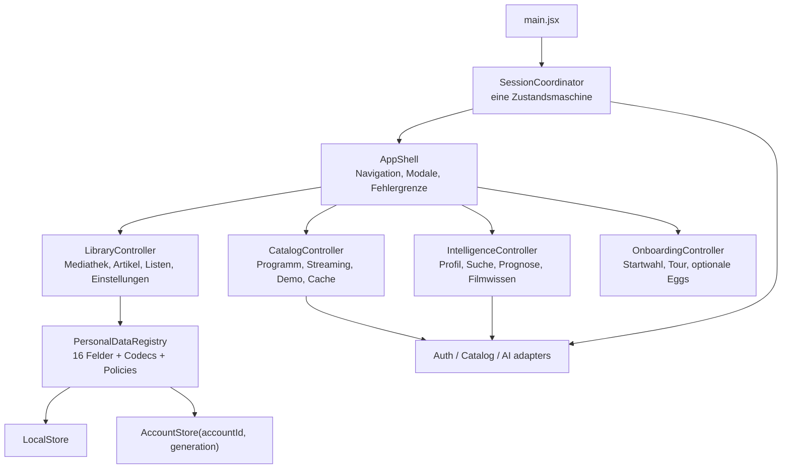

# Kinodreieck – Architektur-Audit vor dem letzten Cleanup

Stand: 31. Juli 2026

Geprüfter Zweig: `codex/etappe-9a-distribution`

Ausgangspunkt: Commit `341d76b`

## Umsetzungsnachtrag desselben Tages

Der folgende Text bleibt als vollständiger Ausgangsbefund erhalten. Der daraus
abgeleitete Umbau wurde anschließend in einem zusammenhängenden
Architekturblock umgesetzt:

- KD-A01 bis KD-A03: gemeinsame `SessionCoordinator`-Grenze,
  accountgebundene Treibergenerationen und Commit-Queues.
- KD-A04/KD-A05: Shared Blogs liegen accountgebunden in
  `kd_shared_articles`; öffentliche Zugriffe laufen über eine schmale RPC,
  fremde Blogs werden on demand als lokale Kopie übernommen.
- KD-A06: `streaming_bekannt` und `streaming_entdecken` sind echte getrennte
  Assets. Der Boot lädt nur den kleinen Teil; der vollständige Katalog erst
  beim Öffnen des Streaming-Tabs. Alte Pipeline-Writes werden serverseitig
  automatisch aufgeteilt.
- KD-A07/KD-A08: lokale Speicherung und bestätigter Remote-Flush sind
  getrennte Verträge; Restore validiert zuerst vollständig, rollt lokale
  Teilfehler zurück und verifiziert anschließend den Kontostand.
- KD-A09/KD-A10: Fachaktionen persistieren außerhalb von React-Updatern; eine
  App-weite Fehlergrenze schützt den letzten UI-Rückfall.
- KD-A11/KD-A13: ein datenfreier Current-Schema-Snapshot ist vorhanden und
  live gezählt; Deno 2.9.4 ist als exakte devDependency gepinnt.
- KD-A12: kritische Übergänge besitzen neue zustandsorientierte Tests; die
  bestehenden Quelltextkanarien bleiben ergänzend erhalten.
- KD-A14: tote und pausierte Produktpfade sowie historische Treiber liegen
  nicht mehr im aktiven Importgraph; GitHub wurde aus der Browser-CSP
  entfernt.
- KD-A15 bleibt absichtlich offen: ignorierte persönliche beziehungsweise
  lokale Arbeitsartefakte werden erst nach ausdrücklicher Freigabe verschoben
  oder gelöscht.

Der lokale Download bleibt Produktbestandteil. PWA und Einzeldatei werden aus
demselben Quellstand gebaut; die Einzeldatei enthält eine echte Demo-Basis und
ist per Doppelklick ohne Server nutzbar.

## Kurzurteil

Kinodreieck ist **kein grundsätzlich falsch gebautes System**. Die grobe
Plattformarchitektur ist für das Produkt sinnvoll:

- eine statisch ausgelieferte React-App,
- Cloudflare Pages als öffentliche Hülle,
- Supabase für Auth, persönliche Daten, RLS, gemeinsamen Katalog und die
  serverseitige KI-Grenze,
- lokaler Cache und eine weiterhin nutzbare Gast-/Offline-Funktion,
- deterministische Fachlogik vor KI,
- eine ungewöhnlich breite Regressionstestsuite.

Das Frankenstein-Gefühl entsteht eine Ebene tiefer:

1. `App.jsx` ist gleichzeitig Bootloader, Zustandscontainer, Repository,
   Workflow-Engine, Navigation und Effekt-Orchestrator.
2. Mehrere historische Betriebsmodelle sind noch gleichzeitig im aktiven
   Modulgraphen: lokaler Betrieb, Account-Sync, alter Git-Sync, alter
   Schlüssel-Supabase-Sync, `kd_store`, Demo-Pfade und Single-File-Fallbacks.
3. Sitzung, aktiver Speichertreiber, Cache-Besitzer und Katalogvariante sind
   getrennte veränderliche Wahrheiten.
4. Die 16 persönlichen Datentöpfe werden an mehreren Stellen von Hand
   aufgezählt.
5. Einige Funktionen sind nur halb in die Accountarchitektur migriert.
6. Kommentare und Tests konservieren teilweise frühere Etappen statt den
   heutigen Produktzustand zu beschreiben.

Die richtige Konsequenz ist **kein Rewrite**. Die stabile Route ist:

> zuerst die Konto-/Speichergrenze als eine einzige Zustandsmaschine
> korrigieren, dann den Legacy-Hybrid entscheiden, anschließend
> `App.jsx` entlang bereits vorhandener fachlicher Gruppen zerlegen.

Damit lässt sich die Architektur deutlich verschlanken, ohne lokale
Offline-Fähigkeit, Single-File-Ausgabe, RLS, Kostenkontrolle oder die
deterministische Fachlogik aufs Spiel zu setzen.

---

## 1. Prüfungsumfang und Evidenz

Geprüft wurden:

- sämtliche 99 JavaScript-/JSX-Dateien unter `src/`,
- alle sieben Haupttabs und die von ihnen verwendeten Komponenten,
- die Service- und Treibergrenzen für Auth, Storage, Katalog und KI,
- Boot, Demo/Clean-Start, Accountwechsel, Übernahme, Backup und Restore,
- Programm-, Streaming- und Shared-Blog-Datenpfade,
- persönliches Profil, Vorbewertung und gemeinsames Filmwissen,
- die Supabase Edge Function und ihre beiden Filmwissen-Module,
- alle SQL-Migrationen und die dokumentierte Alt-Schema-Grenze,
- Vite-, Single-File-, PWA- und Cloudflare-Pages-Builds,
- GitHub-Actions-Deployment und Betriebswerkzeuge,
- die 47 lokalen Testdateien sowie ihre Teststrategie,
- ignorierte Build-, Zwischen- und mögliche personenbezogene Arbeitsartefakte.

### Messwerte

| Bereich | Befund |
| --- | ---: |
| Frontend-Dateien | 111 JS/JSX nach Einführung der Controllergrenzen |
| Frontend-Zeilen | 21.481 |
| `App.jsx` | 2.112 Zeilen |
| React-Zustand in `App.jsx` | 63 `useState`, 31 `useEffect`, 68 `useCallback`, 34 `useRef` |
| Direkte `localStorage`-Operationen in `App.jsx` | 30 |
| Edge-Function-Code | 4.601 TypeScript-Zeilen |
| `ai-task/index.ts` allein | 3.595 Zeilen |
| SQL-Migrationen | 4.426 Zeilen |
| Testdateien | 58 |
| Testcode | 29.129 Zeilen |
| Web-JavaScript-Bundle | 696.570 Bytes, gzip 214.430 Bytes |
| Single-File-App | 1.189.362 Bytes, gzip 563.260 Bytes |

Der aktive Importgraph enthält weder die historischen Einstellungsoberflächen
noch Git-/Legacy-Supabase-Treiber oder die pausierten Inszenierungen. Die
Quelldateien bleiben als getrennte, regressionsgetestete Historie erhalten.

### Ausgeführte Prüfungen

- `npm test`: vollständig grün; umfasst Mock-/jsdom-Tests, Single-File-Build,
  Web-Build und Online-Paket.
- Gezielte lokale Probe „Kontowechsel bei wartendem Commit“: reproduziert;
  ein unter Konto A erzeugter Wert wurde mit dem späteren Token von Konto B
  versandt.
- Gezielte lokale Probe „Cache-Besitzer bei A → B“: reproduziert; vor der
  Treiberaktivierung wird der Fremdkontofall erkannt, danach nicht mehr.
- `git diff --check`: sauber.
- Keine echten KI-Aufrufe und keine kostenpflichtigen Evals ausgeführt.
- `npm run test:function`: mit der im Projekt gepinnten Deno-Version 2.9.4
  lokal 276/276 grün. Es ist keine globale Installation mehr nötig.

---

## 2. Was die App heute tatsächlich ist

Cloudflare führt keine Produktlogik aus. Es liefert nur öffentliche Dateien.
Die operative Backendgrenze liegt vollständig bei Supabase. Das ist eine gute
und einfache Aufteilung und sollte beibehalten werden.

### Die sieben sichtbaren Produktbereiche

| Bereich | Heutige Verantwortung |
| --- | --- |
| Start | persönliches Dashboard, Datenfrische, Kino-, Must-Watch-, Streaming- und Pinboard-Ausschnitte |
| Kino | Wiener Programm, Matching gegen die Mediathek, Zeitfilter, Pins, neue Einträge, Prognose und Filmwissen |
| Streaming | eigenes Programm, Entdecken-Katalog, Diensteauswahl, Merkliste, Prognose und Filmwissen |
| Mediathek | Filme, Reihen, Serien, Musik und Sonstiges; Bewertungen, Quellen, Must-Watch und Artikelreferenzen |
| Suche | deterministischer Finder plus optionale intelligente Suche; Kino-, Bestand- und Streamingquellen |
| Blog | lokale Artikel, Referenzabgleich, Paketexport/-import und accountgebundene öffentliche Projektionen |
| Einstellungen | Darstellung, Startmodus, KI-Schalter, Profil, Konto, Import/Export, Restore, Katalog und Wartung |

### Modulkarte

| Gruppe | Zentrale Module | Aufgabe |
| --- | --- | --- |
| Einstieg und Shell | `main.jsx`, `App.jsx`, `index.css`, `components/NavBand.jsx` | Boot, globale Zustände, Navigation, Modale und Layout |
| Sammlung | `match.js`, `typen.js`, `kategorien.js`, `quellen.js`, `staffeln.js`, `mustwatch.js` | IDs, Bewertungen, Typen, Besitzquellen, Serienstand und Must-Watch |
| Artikel und Austausch | `artikel.js`, `paket.js`, `BlogTab.jsx`, `TeilenBlock.jsx` | Artikelworkflow, Rotlinks, Referenzen und Datei-Pakete |
| Kino | `programm.js`, `kinos.js`, `KinoTab.jsx` | Programmschema, Zeitfilter, Kinoverweise und Matchingdarstellung |
| Streaming | `katalog.js`, `dienste.js`, `StreamingTab.jsx`, `StreamingEinstellungen.jsx` | Katalogread, Dienste, eigene Treffer, Entdecken und Merkliste |
| Suche | `finder.js`, `FinderTab.jsx` | deterministische Sprachzerlegung, Filter, Ranking und optionale KI-Suche |
| Profil | `geschmack.js`, `profil.js`, `extraktion.js`, Profilkomponenten | Onboarding, Einwilligung, Signale, Vorschläge und Promptfassung |
| Prognose | `prognoseAuftrag.js`, `prognose.js`, `vorbewertung.js`, Prognosekomponenten | minimierter Auftrag, Ergebnisvertrag, Speicherung und Annahme/Korrektur |
| Filmwissen | `filmwissen.js`, `filmwissenTransport.js`, `services/filmwissen.js`, Filmwissenkomponenten | starke Kennungen, Cache-Read, Rechercheanstoß und sichtbare Provenienz |
| Auth | `authDriver.js`, `services/auth.js`, `KontoBereich.jsx` | GoTrue-REST, tokenfreier Sessionzustand und Kontooberfläche |
| Persönlicher Speicher | `storage.js`, `accountDriver.js`, `services/storage.js`, `uebernahme.js`, `backup.js`, `restore.js` | lokaler Cache, Accountspiegel, Revisionen, Konflikte, Übernahme und Sicherung |
| Gemeinsamer Katalog | `katalog.js`, `services/catalog.js` | Runtimezugang, getrennte Live-/Demo-Assets, Cache Storage und Demo-Seed |
| KI-Grenze | `aiDriver.js`, `services/ai.js`, `supabase/functions/ai-task/` | geschützter Aufruf, Aufgabenrouting, Limits, Anbieter und Antwortvalidierung |
| Produkterklärung | `tutorial.js`, `tour.js`, `Willkommen.jsx`, `TourOverlay.jsx` | Startentscheidung, KI-Wahl und kontextuelle Hilfen |
| Optionale Inszenierung | `modus.js`, `eggs.js`, `momentEggs.js`, Egg-Komponenten | Themes, Achievements und Easter Eggs |
| Build und Betrieb | Vite-Konfigurationen, `build-single.mjs`, `public/sw.js`, `tools/`, Workflows | Web-/Dateibuild, PWA, Deployment, Smoke- und Betriebskontrollen |

Diese Gruppierung ist im Bestand bereits erkennbar. Die empfohlene
Vereinfachung erfindet daher keine neuen Domänen, sondern macht die vorhandenen
Gruppen zu echten Besitzgrenzen.

### Persönliche Daten

Der aktuelle Accountspeicher ist kein relationales Fachmodell, sondern ein
einfacher Key-/Value-Speicher mit 16 erlaubten JSON- beziehungsweise
String-Töpfen:

- Masterliste,
- Artikel,
- Kino-Pins,
- Merkliste,
- Suchvokabular,
- Einstellungen,
- Entdecken-Status,
- Autorname,
- Streaming-Dienste,
- Must-Watch,
- Achievements,
- Zeitgrenze,
- drei Filterzustände,
- Geschmacksprofil.

`localStorage` ist der schnelle lokale Cache. `kd_personal` ist bei einem
Konto die serverseitige Wahrheit. Revisionen, Konflikte, Snapshots und
ausstehende Writes werden pro Topf geführt.

Dieses Modell ist für die aktuelle Produktgröße grundsätzlich vernünftig:

- es bewahrt Offline- und Single-File-Fähigkeit,
- es hält die DB klein,
- es vermeidet eine große relationale Fachmigration,
- Konflikte bleiben auf einen Bereich begrenzt,
- RLS ist leicht verständlich.

Die Schwäche liegt nicht in den 16 Töpfen selbst, sondern in ihren mehrfachen,
von Hand gepflegten Registrierungen und in der nicht accountgebundenen
Commit-Queue.

### Gemeinsame Daten

Es existieren heute zwei aktive gemeinsame Datenflächen:

1. `kd_catalog` für Programm, getrennte Streamingteile und den Demo-Seed.
2. `kd_shared_articles` für accountgebundene öffentliche Blogprojektionen.

`kd_store` bleibt vorübergehend nur für die Kompatibilität bereits
ausgelieferter Altclients erhalten. Neue Shared-Schreibvorgänge sind blockiert.

Hinzu kommen kleine eingebettete beziehungsweise dateibasierte Fallbacks für
die Doppelklick-/Single-File-Ausgabe.

### KI

Der Client kennt nur die interne Aufgabe und sendet ein Sitzungstoken an die
Supabase Edge Function. Anbieter-Key, Service Role, Budgets, Preise,
Rate-Limits und Protokollierung bleiben serverseitig.

Gebaut sind:

- Health-/Vertragsprobe,
- intelligente Suche,
- Extraktion von Profilsignalen,
- persönliche Filmprognose,
- gemeinsames, belegtes Filmwissen.

`masterlist-enrichment` ist registriert, aber ausdrücklich noch nicht gebaut.
Filmscan und Bloganalyse sind laut aktueller Abnahme keine fertigen
Produktpfade.

Das Filmwissen ist der komplexeste Backendteil. Es verwaltet Werkidentität,
starke Kennungen, Quellenfreigaben, Abrufreservierungen, Snapshots,
unveränderliche Versionen, Belege, aktuelle Zeiger und atomaren Abschluss.
Diese Komplexität ist größtenteils durch Nachvollziehbarkeit, Rechte,
Parallelität und Kosten begründet und sollte nicht leichtfertig in den Client
verschoben oder pauschal „vereinfacht“ werden.

### Laufweg 1: App-Start

1. `main.jsx` initialisiert den Auth-Treiber.
2. Bei gespeicherter Accountsitzung aktiviert es den Accounttreiber und versucht
   vor dem Render einen Pull.
3. `App.jsx` liest Masterliste, Programmcache, Einstellungen, Pins,
   Vokabular und weitere Töpfe.
4. Fehlt eine Masterliste, entscheidet die bestätigte Clean-/Demo-Wahl.
5. Demo lädt online die Demo-Töpfe aus `kd_store`, in Datei-/Testumgebungen
   ersatzweise eine eingebettete Beilage.
6. Nach dem lokalen Boot lädt die App Programm und Streaming aus dem für die
   Sitzung bestimmten Katalogbereich nach.
7. Cache- und Herkunftsmetadaten steuern die sichtbaren Hinweise.

Der Ablauf ist fehlertolerant, besitzt aber heute zwei voneinander getrennte
Boot-Orchestrierungen (`main.jsx` und ein großer App-Effekt) und aktiviert den
Accounttreiber bei unbekanntem Cache-Besitzer zu früh.

### Laufweg 2: Persönliche Änderung

1. Ein Tab ruft eine von `App.jsx` gereichte Action auf oder schreibt bei
   einfachen Präferenzen direkt über `store`.
2. Häufig wird innerhalb eines React-State-Updaters der neue Wert gebaut und
   zugleich persistiert.
3. `store` delegiert an den aktuell global gewählten Treiber.
4. Lokal wird der Wert synchron in `localStorage` geschrieben.
5. Im Accountmodus wird der Topf als ausstehend markiert.
6. Eine pro Topf serialisierte Hintergrundqueue liest später den aktuellen
   lokalen Wert und holt dann ein aktuelles Sitzungstoken.
7. PostgREST legt die Zeile an oder aktualisiert sie unter einer bekannten
   Revision; Abweichungen werden Konflikte.

Der lokale-first-Teil ist sinnvoll. Fehlerhaft ist, dass Schritt 6 keine
unveränderliche Accountbindung besitzt und Schritt 2 React-Zustandsänderung mit
Seiteneffekten vermischt.

### Laufweg 3: Programm und Streaming

1. Runtimewerte liefern eine öffentliche Supabase-URL und einen
   Publishable-Key; lokale Overrides können sie ersetzen.
2. Der Katalogservice entscheidet anhand eines verfügbaren Tokens zwischen
   `live` und `demo`.
3. `kd_catalog` wird per PostgREST gelesen.
4. Erfolgreiche große Payloads landen in Cache Storage, getrennt nach
   Zeilenname.
5. Bei einem direkten Fehler darf ein alter Cache einspringen, bleibt aber als
   Cache-/Fehlerstand sichtbar.
6. Programm wird normalisiert und gegen die Masterliste gematcht.
7. Streaming wird aus `bekannt` und `entdecken` zu „mein Programm“ und
   Entdecken aufgebaut.
8. Die Single-File-Ausgabe verwendet bei fehlendem HTTP-Pfad eingebettete oder
   Sidecar-Snapshots.

Die Herkunfts- und Cachelogik ist sorgfältig. Zu vereinfachen sind die
doppelte Definition der Katalogvariante, die manuelle Produktionskonfiguration
und die nur behauptete Streaming-Lazy-Grenze.

### Laufweg 4: KI und Filmwissen

1. Geräteschalter, Funktionsschalter und bereite Accountsitzung öffnen den
   jeweiligen Produktpfad.
2. Ein Fachmodul baut einen minimierten, validierten Payload.
3. `services/ai.js` verlangt die Accountfähigkeit und erzeugt eine Vorgangs-ID.
4. `aiDriver.js` sendet nur den erlaubten Vertrag und das JWT an `ai-task`.
5. Die Edge Function prüft Größe, Auth, Konfiguration, Aufgabenschema,
   Tages-/Monats-/Parallelgrenzen und reserviert den Auftrag.
6. Sie baut den Prompt serverseitig, ruft Anthropic auf, prüft die strukturierte
   Antwort und schließt Log sowie Kosten.
7. Der Client validiert erneut und speichert nur das Produktobjekt, nicht die
   rohe Modellantwort.

Beim Filmwissen kommt davor beziehungsweise danach hinzu:

1. Read-only-RPC mit einer starken Filmkennung,
2. bei Cache-Miss serverseitige Quellenreservierung,
3. feste Wikidata-/LOC-Adapter und Snapshot,
4. Synthese,
5. atomare Version-/Beleg-/Zeiger-Publikation,
6. erneuter Client-Read des veröffentlichten Stands.

Dieser Datenpfad ist konzeptionell sauber. Seine Hauptschwäche ist die
physische Größe des Function-Einstiegs, nicht eine falsche Plattformgrenze.

### Laufweg 5: Build und Veröffentlichung

1. `npm test` führt die lokalen Mock-, Vertrags-, jsdom- und Buildprüfungen
   seriell aus.
2. GitHub Actions installiert zusätzlich Deno und führt den Function-Test aus.
3. Staging und Produktion bauen jeweils mit ihrer öffentlichen
   Runtimekonfiguration.
4. `build:online` erzeugt Web-PWA und Single-File-Download und bereitet
   Service Worker sowie Header vor.
5. Wrangler veröffentlicht `dist/` auf Cloudflare Pages.
6. Deployment- und Domain-Smokes prüfen anschließend die ausgelieferte Version.

Das ist eine verständliche Releasearchitektur. Zu verbessern sind
Toolchain-Parität, eindeutige Function-Versionierung und die Wiederholbarkeit
des vollständigen Supabase-Schemas.

---

## 3. Was ausdrücklich bleiben sollte

### 3.1 Cloudflare Pages plus Supabase

Ein Wechsel zu einem eigenen Node-Server oder Cloudflare Worker für alle
Funktionen würde eine weitere Laufzeit, weitere Secrets, Deploymentpfade und
Fehlerklassen hinzufügen. Auth, RLS, PostgREST, RPCs und Edge Function liegen
heute sinnvoll in einem System.

### 3.2 Lokaler, accountloser Betrieb

Der Gastmodus ist kein provisorischer Fehlerzustand, sondern ein wertvoller
Produktmodus. Er ermöglicht:

- Nutzung ohne Konto,
- Offline-Arbeit,
- Datei-Backup,
- die eigenständige HTML-Ausgabe,
- einen sicheren Rückfall bei Backendproblemen.

### 3.3 Die deterministischen Fachmodule

Matching, Finder, Artikelabgleich, Profilvalidierung, Prognosevertrag,
Must-Watch, Serienlogik, Quellen und Paketformat sind überwiegend als pure
Module gebaut und breit getestet. Sie sind nicht die Ursache des
Architekturproblems.

### 3.4 Serverseitige Sicherheitsinvarianten

Folgendes gehört weiter in DB beziehungsweise Edge Function:

- Accountableitung aus dem JWT statt einer Client-ID,
- RLS,
- Budgetreservierung und Kostenabschluss,
- Rate- und Parallelitätslimits,
- Quellenrechte,
- atomare Filmwissen-Publikation,
- providerunabhängige Antwortvalidierung.

### 3.5 Die zwei Auslieferungsformen

PWA und Single-File-App verursachen zusätzliche Adapterlogik. Solange der
herunterladbare Doppelklick-Betrieb ein echtes Produktziel ist, ist diese
Komplexität legitim. Sie sollte hinter einer Katalogquellen-Grenze verschwinden,
nicht durch Entfernen einer zugesagten Auslieferungsform.

Dabei ist der Download ausdrücklich **ein Datenpaket und nicht nur eine
Offline-Shell mit gespeicherten Lesezeichen**. Er muss eine kuratierte,
versionierte Ausgangsbasis mitbringen, auf der Mediathek, Finder und die übrigen
deterministischen Funktionen ohne zuvor aufgebauten Browser-Cache sinnvoll
arbeiten können. Online-Aktualisierung darf diese Basis ergänzen, aber nicht zur
Voraussetzung für den ersten echten lokalen Gebrauch machen.

Verbindliche Invarianten:

- Die PWA bleibt installierbar und nach dem ersten vollständigen Laden offline
  startfähig.
- Das Downloadpaket bleibt ohne Server und ohne Konto lokal nutzbar.
- Das Paket enthält beziehungsweise referenziert innerhalb seines eigenen
  Verzeichnisses eine geprüfte Basisdaten-Version.
- Persönliche Daten bleiben getrennt von dieser unveränderlichen Basis und
  können weiterhin exportiert, importiert und gesichert werden.
- Katalogaktualisierungen ersetzen die Basis kontrolliert; sie machen eine
  vorhandene lokale Installation bei Netzfehlern nicht unbrauchbar.

---

## 4. Fehler- und Risikoregister

Das Register enthält den Prüfstand und wird während der Vereinfachung
fortgeschrieben. **KD-A01 bis KD-A03 wurden im ersten Architekturblock am
31. Juli 2026 behoben und durch neue Grenztests abgesichert.** Die übrigen
Punkte bleiben die Arbeitsliste für die folgenden Blöcke.

### KD-A01 – Kritisch: Kontowechsel überschreibt die Besitzinformation vor der Entscheidung

**Status: behoben im ersten Architekturblock.**

**Evidenz**

- `aktiviereKontoTreiber(accountId)` prüft zunächst einen fremden Besitzer,
  verwirft dann Treiberzustand und schreibt sofort den neuen Besitzer nach
  `kd:acct:owner`.
- Erst danach öffnet die Oberfläche den Übernahme-Assistenten.
- `inventurLaden()` fragt den Fremdkontofall zu diesem späteren Zeitpunkt ab.
  Er kann dann nicht mehr wahr sein.
- Beim App-Start aktiviert `main.jsx` den Treiber und führt sogar bereits vor
  dem ersten Render einen Pull aus.
- Der Kommentar in `lib/uebernahme.js` verlangt dagegen ausdrücklich eine
  Inventur **vor** der Treiberaktivierung.

**Folge**

Beim Wechsel von Konto A zu Konto B kann die Warnung „Diese Daten gehören zu
einem anderen Konto“ verschwinden. Bei einem Reload kann ein Pull von Konto B
lokale Daten von A überschreiben, bevor der Nutzer eine Übernahmeentscheidung
sieht.

**Vereinfachende Korrektur**

Ein einziger Session-/Storage-Koordinator führt den Zustand
`account-awaiting-adoption` ein. Bei unbekanntem oder abweichendem
Cache-Besitzer:

1. Accounttransport nur lesend für die Inventur bereitstellen,
2. Alltagstreiber noch nicht aktivieren,
3. keine Remote-Commits zulassen,
4. erst nach der Entscheidung Besitzer setzen, Treiber binden und gegebenenfalls
   pullen.

### KD-A02 – Kritisch: Eine Commit-Queue ist nicht an das erzeugende Konto gebunden

**Status: behoben im ersten Architekturblock.**

**Evidenz**

- Es gibt genau eine langlebige `accountDriver`-Instanz.
- Die Queues leben in deren Closure und werden bei Kontoabmeldung oder
  Kontowechsel nicht verworfen.
- `set()` sichert lokal, startet den Commit nur im Hintergrund und gibt sofort
  zurück.
- `commitKeyNow()` liest den dann aktuellen `localStorage`-Wert.
- Der Token wird erst beim tatsächlichen Request dynamisch vom Auth-Treiber
  geholt.

Eine lokale Probe hat reproduziert:

- Wert unter „Konto A“ erzeugt,
- vor Ausführung der Queue auf Token B gewechselt,
- Request enthielt den A-Wert mit `Authorization: Bearer token-account-b`.

**Folge**

Bei einem ungünstigen Logout-/Login-Zeitpunkt können persönliche Daten in das
falsche Konto geschrieben werden.

**Vereinfachende Korrektur**

Pro Sitzung eine neue accountgebundene Treiberinstanz erzeugen. Jeder Auftrag
trägt unveränderlich:

- erwartete Account-ID,
- Treibergeneration,
- den zu sendenden Wert oder eine accountgebundene Coalescing-Referenz.

Vor jedem Request muss der Authkontext dieselbe Account-ID bestätigen.
Abmeldung oder Kontowechsel invalidiert die Generation und beendet oder
verwirft die alte Queue kontrolliert.

### KD-A03 – Hoch: Automatischer Sitzungsablauf schaltet den Accounttreiber nicht ab

**Status: behoben im ersten Architekturblock.**

**Evidenz**

- Beim Sichtbarwerden ruft `main.jsx` nur `authService.refresh()` auf.
- Ein endgültig abgelaufenes Refresh-Token setzt den Authsnapshot auf Gast.
- Nur der manuelle Logout in `KontoBereich` ruft anschließend
  `deaktiviereKontoTreiber()` auf.

**Folge**

Die UI kann Gast anzeigen, während `storageService.mode` und `store` weiter den
Accounttreiber verwenden. Änderungen werden als ausstehende Accountänderungen
markiert, obwohl kein Konto mehr aktiv ist.

**Vereinfachende Korrektur**

Authzustand und Speichertreiber nie mehr an getrennten Stellen umschalten.
Jeder Sessionübergang läuft durch denselben Koordinator.

### KD-A04 – Kritisch für Datenschutz: Das Löschen eines geteilten Blogs kann öffentlich wirkungslos bleiben

**Status: behoben im zweiten Architekturblock.**

**Evidenz**

- Beim lokalen Löschen oder Abschalten von „geteilt“ wird
  `unpublishSharedArticle()` gestartet.
- Fehler werden an beiden Stellen absichtlich verschluckt.
- Der lokale Artikel kann danach bereits verschwunden sein.

**Folge**

Ein öffentlich lesbarer Artikel kann bei Netz- oder Rechtefehler weiter in
`kd_store` liegen, während die App ihn lokal als gelöscht beziehungsweise nicht
geteilt darstellt. Es gibt danach keinen sichtbaren Retrygegenstand mehr.

**Vereinfachende Korrektur**

Die Fachfunktion „Blogs für alle“ bleibt erhalten. Vereinfacht wird nicht das
Produktziel, sondern der heutige doppelte technische Pfad: Der persönliche
Quellartikel bleibt im Konto, eine veröffentlichte Projektion liegt zusätzlich
in einem gemeinsamen DB-Bereich und ist für andere Nutzer lesbar.

Dieser Publikationspfad braucht einen echten accountgebundenen Zustand:

- `local`, `publishing`, `published`, `unpublishing`, `error`,
- serverseitige Autorenbindung über die angemeldete Account-ID,
- sichtbare Fehler,
- wiederholbare Löschung,
- kein lokales endgültiges Löschen vor bestätigtem Unpublish oder ein
  beständiger Tombstone.

### KD-A05 – Hoch: Neue Konten sehen eine Shared-Funktion, die nur über Legacy-Zugang schreiben kann

**Status: behoben im zweiten Architekturblock.**

**Evidenz**

- Der „Shared“-Schalter ist im aktiven Blogformular sichtbar.
- Publikation läuft weiterhin über `supabaseDriver.publishBlog()`.
- Dieser Pfad verlangt die alten lokalen `kd:sb:*`-Daten samt geheimem
  Sync-Schlüssel.
- Die einzige Oberfläche zur Konfiguration liegt unter `src/legacy/` und ist
  nicht im aktiven UI-Modulgraphen.

**Folge**

Ein gewöhnlicher Account kann „geteilt“ wählen, der Artikel wird lokal als
freigegeben gespeichert, die Veröffentlichung schlägt danach asynchron fehl.
Lokaler Zustand und öffentliche Wahrheit widersprechen einander.

**Vereinfachende Korrektur**

Die Shared-Funktion vollständig in einen accountgebundenen öffentlichen
Publikationspfad migrieren. Entfernt wird nur der Legacy-Zugang über
`kd:sb:*` und geheimen Sync-Schlüssel, nicht die Funktion selbst. Der heutige
Hybrid sollte nicht bleiben.

### KD-A06 – Hoch: Der große Streaming-Katalog wird nicht wirklich lazy geladen

**Status: behoben.** Die folgende Evidenz beschreibt den Ausgangszustand.

**Evidenz**

- `ladeStreamingDateien(false)` und `ladeStreamingDateien(true)` rufen beide
  `catalogService.loadArea("streaming")` auf.
- Der einzige Unterschied ist ein Timeout von 15 statt 20 Sekunden.
- `kd_catalog.streaming` enthält `{ bekannt, entdecken }` in einer Zeile.
- Die Payloadprüfung verlangt beide Teile.
- `baueStreamingAnsichten()` verarbeitet immer beide Teile.
- `entdeckenGeladen` wird geschrieben und zurückgesetzt, aber nie gelesen.

**Folge**

Der Kommentar verspricht beim Boot nur die leichte Ansicht und beim Öffnen des
Tabs den mehrere MiB großen Katalog. Tatsächlich wird bereits beim Boot dieselbe
vollständige Payload geladen und geparst.

**Vereinfachende Korrektur**

Entweder:

- zwei echte Assets `streaming_bekannt` und `streaming_entdecken` einführen,
  wobei nur das zweite lazy geladen wird,

oder:

- die vermeintliche Trennung samt `vollKatalog` und `entdeckenGeladen` entfernen
  und den tatsächlichen Voll-Load ehrlich als einen Pfad behandeln.

Für Netzlast und Startzeit ist die echte Assettrennung vorzuziehen.

### KD-A07 – Hoch: `await store.set()` bedeutet nicht „im Konto gespeichert“

**Status: behoben durch getrennte local-first- und Flush-Verträge.**

**Evidenz**

Der Accounttreiber wartet nur auf `localStorage.setItem()`. Der Remote-Commit
wird ohne `await` eingereiht. Viele Aufrufer verwenden dennoch Namen und
Kommentare wie `persist…`, „streng gespeichert“ oder „atomar“.

**Folge**

Ein erfolgreicher `await` kann Remote-Ablehnung, verlorene Sitzung,
Kontowechsel, Größenlimit oder Offlinezustand nicht melden. Besonders bei
bezahlten KI-Ergebnissen und Restore ist die erwartete Dauerhaftigkeit unklar.

**Vereinfachende Korrektur**

Zwei eindeutige Verträge:

- `saveLocal()` beziehungsweise normales local-first Speichern,
- `flushRemote()` oder `saveDurably()` für Vorgänge, die bestätigte
  Kontodauerhaftigkeit brauchen.

Die Oberfläche muss nicht auf jeden Klick warten. Sie muss nur ehrlich zwischen
„lokal gesichert“ und „mit Konto synchron“ unterscheiden.

### KD-A08 – Hoch: Restore ist lokal und remote nicht atomar

**Status: behoben durch vollständige Vorvalidierung, Staging, lokales Rollback
und bestätigten Remote-Flush.**

**Evidenz**

- Vorher wird korrekt ein vollständiger Rückholpunkt gesichert.
- Danach werden bis zu 16 Töpfe nacheinander geschrieben.
- Schlägt ein späterer Write fehl, bleiben frühere Writes aktiv.
- Die Fehleroberfläche zeigt den Rückgängig-Knopf nur, wenn ein vollständiger
  Bericht vorliegt; nach einer geworfenen Ausnahme bleibt der Bericht `null`.
- Im Kontomodus starten zusätzlich bis zu 16 unabhängige Hintergrund-Commits.

**Folge**

Ein Speicherquota- oder Treiberfehler in der Mitte kann einen teilrestaurierten
lokalen Stand hinterlassen. Remote kann der Restore ebenfalls nur teilweise
ankommen.

**Vereinfachende Korrektur**

Kurzfristig:

- alle Werte vollständig dekodieren und validieren,
- temporär als Restore-Plan staging,
- lokale Writes bei Fehler automatisch aus dem Snapshot zurückrollen,
- Rückrollmöglichkeit auch im Fehlerzustand anzeigen,
- nach erfolgreichem lokalen Restore einen expliziten Remote-Flush samt
  Verifikation ausführen.

Langfristig kann ein serverseitiger Bulk-RPC die 16 Remotewrites in einer
Transaktion durchführen. Eine Migration auf ein einziges Riesendokument ist
dafür nicht nötig.

### KD-A09 – Mittel: Seiteneffekte innerhalb von React-State-Updatern

**Status: behoben; ein Architekturtest schützt die reinen Updater.**

In zahlreichen `setState(prev => …)`-Funktionen werden gleichzeitig
`persist…`, `store.set()`, Publish oder Unpublish aufgerufen.

State-Updater sollen rein sein. React Strict Mode darf sie in der Entwicklung
mehrfach aufrufen. Netzwerk- und Speicheroperationen darin können daher
doppelt, in einer unerwarteten Reihenfolge oder aus einem verworfenen
Renderpfad entstehen.

**Vereinfachende Korrektur**

Pro Fachbereich eine kleine Action-/Controller-Schicht:

1. reine Zustandsänderung beschreiben,
2. neuen Zustand genau einmal persistieren,
3. externe Publikation getrennt und beobachtbar ausführen.

Kein Redux ist dafür nötig.

### KD-A10 – Mittel: Keine letzte UI-Fehlergrenze

**Status: behoben durch `AppErrorBoundary`.**

Es gibt keine React Error Boundary. Ein unerwarteter Renderfehler kann den
gesamten Baum entfernen. Ein Kommentar in `DatenTab.jsx` dokumentiert, dass
genau dies bereits einmal passiert ist.

**Vereinfachende Korrektur**

Eine kleine App-weite Fehlergrenze mit:

- verständlichem Fehlerbild,
- „neu laden“,
- „Gesamt-Backup versuchen“, soweit noch möglich,
- technischer Fehler-ID ohne persönliche Inhalte.

### KD-A11 – Mittel: Die Datenbank ist aus dem Repository nicht vollständig reproduzierbar

**Status: behoben durch `supabase/current_schema.sql`; der Snapshot enthält
18 Tabellen, 42 Funktionen, 13 Trigger und 21 Policies.**

- `kd_personal` und spätere Tabellen liegen in Migrationen.
- Das historische Basisschema von `kd_catalog` liegt separat in
  `supabase/katalog_schema.sql`.
- Das Basisschema von `kd_store`, einschließlich `kd_key_ok` und Policies,
  liegt nicht im Repository.
- `supabase/config.toml` bildet bewusst nicht den Projektzustand ab.
- Historische Migrationen wurden manuell ausgeführt; einige Protokollzeilen
  enthalten keine Ausführungsdaten.

**Folge**

Ein neues Supabase-Projekt lässt sich nicht allein aus dem Repository
verlässlich auf denselben Stand bringen. Das erschwert Recovery, Review und
späteres Entfernen von Legacy.

**Vereinfachende Korrektur**

Migrationen nicht nachträglich umschreiben. Zusätzlich einen bereinigten,
geheimnisfreien **Current-Schema-Snapshot** erzeugen:

- Tabellen, Spalten, Constraints,
- Funktionen und Trigger,
- Grants und Policies,
- keine produktiven Daten und keine Secrets.

Neue Umgebungen werden gegen diesen Snapshot geprüft. Zukünftige Änderungen
bleiben normale additive Migrationen.

### KD-A12 – Mittel: Testsuite ist breit, aber zu häufig quelltextgebunden

**Status: wesentlich verbessert.** Kritische Konto-, Restore-, Shared-,
Streaming- und Controllerübergänge werden inzwischen verhaltensorientiert
geprüft; die Quelltexttests bleiben als Architekturkanarien.

23 der 47 Testdateien lesen Quelltext oder Buildtext direkt und prüfen
Zeichenketten beziehungsweise reguläre Ausdrücke. Das ist als
Architekturkanarie nützlich, ersetzt aber keine Übergangstests.

Die zwei kritischsten Kontofehler blieben trotz grüner Suite bestehen, weil
keine Tests für folgende Abläufe existieren:

- Cache-Besitzer A, Login B, Inventur vor Aktivierung,
- wartender A-Write während Login B,
- automatischer Sitzungsablauf bei aktivem Accounttreiber,
- fehlschlagendes Unpublish,
- Teilfehler während Restore,
- tatsächlich unterschiedliche Streaming-Netzlast bei leicht/voll.

**Vereinfachende Korrektur**

Die Quelltextkanarien behalten, aber schrittweise durch wenige
zustandsmaschinenorientierte Integrationstests ergänzen. Die Testskripte in
fachliche Gruppen teilen, statt die vollständige Suite als eine sehr lange
Shellkette zu definieren.

### KD-A13 – Mittel: Lokale Function-Entwicklung und CI verwenden nicht dieselbe Werkzeugbasis

**Status: behoben.** Deno 2.9.4 ist eine exakte devDependency; 276 gemockte
Function-Tests laufen lokal über das npm-Skript.

`npm run test:function` setzt ein globales `deno` voraus. CI installiert es,
die lokale Projektinstallation nicht. Dadurch kann die wichtigste
Function-Suite auf einem frischen Entwicklungsrechner trotz `npm install`
nicht ausgeführt werden.

**Vereinfachende Korrektur**

Eine dokumentierte, gepinnte Toolchain beziehungsweise ein Bootstrap-Check,
der Deno-Version und Verfügbarkeit vor dem Test klar prüft. Kein stilles
Überspringen.

### KD-A14 – Niedrig bis mittel: Aktiver und historischer Code sind vermischt

**Status: im aktiven Client behoben.** Historische Quelldateien bleiben
regressionsgetestet vorhanden, werden aber nicht importiert oder gebündelt.

Konkrete Beispiele:

- `StartLanding` ist definiert, `StartTab` rendert aber immer
  `StartDashboard`.
- `PERSONAL_MODE` ist konstant `false`, wird aber noch als
  Architekturverzweigung beschrieben.
- `resetMaster` wird in `App.jsx` gebaut und als Prop gereicht, von
  `DatenTab` aber nicht angenommen.
- `entdeckenGeladen` hat keinen Leser.
- `syncOnboardingOffen` ist eine permanente `false`-Konstante.
- pausierte Eggs halten weiterhin umfangreiche Verdrahtung in `App.jsx`.
- die zwei Legacy-Einstellungsseiten sind unerreichbar.
- Git- und Legacy-Supabase-Treiber werden trotzdem ins produktive Bundle
  gezogen.

Der gebaute Web-Code enthält nachweislich noch Marker für `kd:git:token`,
`kd:sb:key` und Legacy-Publikation. Die CSP erlaubt deshalb weiterhin
`https://api.github.com`, obwohl die aktive Accountoberfläche Git nicht
verwendet.

**Vereinfachende Korrektur**

Unerreichbare Produktvarianten löschen oder in einen nicht importierten
Archivordner verschieben. Feature-Flags sollen entweder einen gebauten
Produktmodus schalten oder nicht im aktiven Graphen stehen.

### KD-A15 – Niedrig: Arbeits- und personenbezogene Artefakte liegen ignoriert im Projektordner

Unter anderem:

- `_to_delete/` mit rund 24 MiB Altständen,
- `dist-single-beta/`,
- mehrere `eval_rohdaten_*.json`,
- `.env.live.local`,
- generierte `dist*`-Verzeichnisse.

Git ignoriert sie korrekt. Für Datenschutz, Backups und versehentliche
Weitergabe ist der Projektordner trotzdem kein guter dauerhafter Ablageort für
Eval-Rohdaten oder Live-Konfiguration.

**Vereinfachende Korrektur**

Im letzten Cleanup nach ausdrücklicher Freigabe:

- Rohdaten und Live-Konfiguration in einen klaren externen, geschützten
  Arbeitsordner verschieben,
- veraltete Builds und `_to_delete` kontrolliert entsorgen,
- nur reproduzierbare Artefakte im Repository-Arbeitsbaum belassen.

---

## 5. Woher die Komplexität kommt

### 5.1 `App.jsx` ist nicht nur „zu lang“, sondern besitzt zu viele Lebenszyklen

Die 2.689 Zeilen wären allein noch kein Fehler. Problematisch ist die Mischung
unabhängiger Zustandsmaschinen:

- Boot und Startwahl,
- Authsnapshot und Kontowechsel,
- persönlicher Datensatz,
- Demo-Seeding und Demo-Entfernung,
- Programmladung,
- Streamingladung,
- Katalogvariantenwechsel,
- Finder-Sitzungsverlauf,
- Artikelworkflow,
- Must-Watch,
- Profil,
- Vorbewertung,
- Filmwissen,
- Tour,
- Themes,
- mehrere Easter Eggs,
- Import, Export und Backup.

Dadurch hängen Änderungen über sehr große Dependency-Arrays und Generation-Refs
zusammen. Viele Kommentare erklären nicht mehr Fachlogik, sondern die
Reihenfolge früherer Fehlerkorrekturen.

### 5.2 Die Servicegrenze ist vorhanden, aber porös

`services/auth`, `storage`, `catalog` und `ai` sind eine gute Idee. In der
Praxis:

- exportiert `services/storage` wieder `store` und alle rohen Keys,
- greifen Tabs direkt auf Töpfe und Serialisierungsformen zu,
- greift `App.jsx` zusätzlich direkt auf `localStorage` zu,
- ziehen Services Legacy-Treiber in den aktiven Graphen,
- liegen manche Netztransporte unter `lib/`, andere Fachlogik ebenfalls.

Das Problem lässt sich durch klarere Verantwortungen lösen, nicht durch noch
eine fünfte Abstraktionsschicht.

### 5.3 Die 16 Töpfe haben kein gemeinsames Register

Die Menge steckt separat in:

- `ACCOUNT_SYNC_KEYS`,
- der DB-Constraint,
- Backup-Feldern,
- Restore-Zielliste und Restore-Code,
- Übernahme-Labels und Zählregeln,
- Fresh-Start-Reset,
- Tests und historischen Kommentaren.

Deshalb sprechen aktuelle Kommentare noch von 11 oder 15 Töpfen, obwohl es 16
sind. Ein neuer Topf verlangt Änderungen an vielen Orten.

### 5.4 Der Legacy-Pfad ist kein isoliertes Archiv

Obwohl Git- und schlüsselbasierter Supabase-Sync als eingefroren beschrieben
werden, verwendet die aktive App noch:

- Legacy-Supabase für Shared-Blog-Schreiben,
- `kd_store` für Shared-Blog-Lesen,
- `kd_store` für Demo-Blobs,
- Git-Konfigurationsprüfung im Restore-Hinweis.

Damit ist Legacy weder entfernt noch wirklich gekapselt.

### 5.5 Der Edge-Endpunkt ist nur deploymentseitig ein Monolith

Eine Function darf intern aus vielen Modulen bestehen. Das Repository beweist
das bereits mit `filmwissen-task/vertrag.ts` und `quellen.ts`.
`ai-task/index.ts` vermischt dennoch:

- HTTP/CORS,
- Auth,
- Konfiguration,
- Budget und Logging,
- Anthropic-Adapter,
- Schemahilfen,
- fünf gebaute Aufgaben,
- Filmwissen-Orchestrierung.

Die Laufzeitarchitektur muss nicht geändert werden. Nur die Quelldatei braucht
fachliche Module.

---

## 6. Empfohlene Zielarchitektur

### 6.1 Ein SessionCoordinator

Er besitzt allein:

- Authsnapshot,
- erwartete Account-ID,
- Cache-Besitzer vor der Anmeldung,
- aktive Treibergeneration,
- Katalogvariante,
- Übergangszustand der Kontoübernahme.

Sinnvolle Zustände:

- `guest`,
- `account-awaiting-adoption`,
- `account-ready`,
- `account-degraded`.

Sinnvolle Ereignisse:

- `initialize`,
- `signIn`,
- `refresh`,
- `signOut`,
- `adoptLocal`,
- `adoptRemote`,
- `sessionExpired`.

Kein UI-Modul aktiviert oder deaktiviert danach selbst einen Treiber.

### 6.2 Ein PersonalDataRegistry

Ein deklaratives Register beschreibt pro Topf:

- Storage-Key,
- Anzeigename,
- Backup-Feld,
- Codec/Validator,
- Zählfunktion,
- synchronisiert ja/nein,
- Reset-/Restore-Verhalten,
- maximale erwartete Größe.

Aus diesem Register werden erzeugt:

- Frontend-Syncliste,
- Backup-/Restore-Schleifen,
- Übernahmevorschau,
- Resetliste,
- Testmatrix.

Die DB-Whitelist bleibt aus Sicherheitsgründen explizit in SQL. Ein Test
vergleicht sie aber gegen die aus dem Register erzeugte erwartete Liste.

### 6.3 Fachcontroller statt globalem State-Framework

Empfohlene erste Extraktionen:

1. `useLibraryController`
   - Masterliste,
   - Artikel,
   - Must-Watch,
   - Pins,
   - Merkliste,
   - persönliche Einstellungen,
   - Import/Export.
2. `useCatalogController`
   - Programm,
   - Streaming,
   - Katalogvariante,
   - Cachemetadaten,
   - Generation und Reload.
3. `useIntelligenceController`
   - KI-Schalter,
   - Profil,
   - Vorbewertung,
   - Filmwissen,
   - kostenpflichtige Lauf-IDs und Abbruch.
4. `useOnboardingController`
   - Startwahl,
   - Willkommen,
   - Tour,
   - optionale Easter Eggs.

Die Tabs bekommen gruppierte Objekte wie `library`, `forecast` und
`filmKnowledge`, nicht jeweils 15 einzelne Props.

Redux, Zustand oder ein anderer globaler Store ist dafür nicht nötig. Die
vorhandenen React-Mittel reichen.

### 6.4 Katalogquellen hinter einem Adapter

`App.jsx` sollte nicht wissen, ob Daten aus:

- Supabase,
- Cache Storage,
- eingebettetem Snapshot,
- Sidecar der Single-File-Ausgabe

stammen. Ein `CatalogSource` liefert denselben validierten Vertrag und dieselbe
Provenienz.

Online:

- `programm`,
- `streaming_bekannt`,
- lazy `streaming_entdecken`,
- `demo_seed`.

Datei:

- eingebettete beziehungsweise Sidecar-Varianten derselben vier Verträge.

Damit kann `kd_store scope=demo` entfallen, sobald `demo_seed` im Katalog liegt.

### 6.5 Shared Blogs aus dem Legacy-Pfad lösen

Das Produktmodell ist klar und kann mit einer kleinen Architektur abgebildet
werden:

1. Der persönliche Quellartikel bleibt im privaten Accountspeicher.
2. „Teilen“ schreibt beziehungsweise aktualisiert eine öffentliche Projektion
   in einer eigenen Tabelle, zum Beispiel `kd_shared_articles`.
3. Die Autoren-ID wird serverseitig aus `auth.uid()` abgeleitet und nicht als
   frei vertrauenswürdiger Clientwert übernommen.
4. `SELECT` ist für die gewünschte Öffentlichkeit erlaubt; `INSERT`, `UPDATE`
   und `DELETE` erlaubt RLS nur dem jeweiligen Autor.
5. Andere Nutzer laden einen veröffentlichten Blog bei Bedarf als eigene Kopie
   in ihre Mediathek.

Damit gibt es fachlich weiterhin zwei Ablageorte, aber nur einen
Authentifizierungsweg: privater Kontodatensatz plus öffentliche Projektion,
beide über die normale Accountsession. Der geheime Legacy-Sync-Schlüssel und
der zweite Supabase-Treiber entfallen.

Für das Laden in die Mediathek sollte ausdrücklich zwischen zwei Semantiken
entschieden werden:

- **Snapshot:** Die geladene Kopie bleibt erhalten, wenn der Autor später
  nicht mehr teilt; die App kann die Quelle als nicht mehr verfügbar markieren.
- **Live-Referenz:** Änderungen und Unpublish wirken automatisch auf fremde
  Mediatheken.

„In die Mediathek laden“ spricht für den stabileren und verständlicheren
Snapshot. Die heutige automatische Entfernung gezogener Kopien bei fehlender
Quelle passt dazu nicht und sollte beim Umbau korrigiert werden.

Zusätzlich:

- Demo-Blobs nach `kd_catalog` migrieren,
- danach Git-Treiber, Legacy-Supabase-Treiber, `kd:treiber`, `kd:git:*`,
  `kd:sb:*`, die Legacy-Einstellungsseiten und GitHub aus der CSP entfernen,
- `kd_store` nach Migration der Shared-Daten und Prüfung stilllegen.

### 6.6 Edge Function intern modularisieren

Ein Endpunkt bleibt. Empfohlene Dateien:

- `index.ts` – nur Start und Routing,
- `http.ts` – CORS, JSON und Fehlerhülle,
- `auth.ts`,
- `config.ts`,
- `budget.ts`,
- `provider/anthropic.ts`,
- `tasks/intelligent-search.ts`,
- `tasks/profile-extract.ts`,
- `tasks/film-forecast.ts`,
- `tasks/filmwissen-synthese.ts`,
- `filmwissen/orchestrator.ts`.

Zuerst verhaltensbasierte Function-Tests schaffen, dann verschieben. Keine
Prompt- oder Budgetänderung im selben Schritt.

### 6.7 Aktuelle Architektur dokumentieren, Etappengeschichte archivieren

Behalten:

- eine aktuelle Systemübersicht,
- Datenklassifikation,
- Betriebsrunbooks,
- ADRs für tatsächlich getroffene dauerhafte Entscheidungen,
- Migrationshistorie.

Archivieren beziehungsweise klar als historisch markieren:

- abgeschlossene Etappenpläne,
- Kommentare, die nur alte Phasennummern oder behobene Zwischenfehler erklären,
- widersprüchliche `PERSONAL_MODE`-/Landing-Beschreibungen.

---

## 7. Bewusst verworfene „Vereinfachungen“

### Alles in ein einziges Account-JSON legen

Vorteil: ein Write, ein Restore, ein Register.

Nachteile:

- jeder kleine Klick überträgt das Gesamtdokument,
- ein Konflikt blockiert die komplette App,
- 1-MiB-Grenze wird schneller relevant,
- Migration ist riskant,
- parallele Tabs und Geräte verlieren die heutige Topfgranularität.

**Urteil:** jetzt nicht tun. Registry und Bulk-RPC lösen die realen Probleme
mit weniger Risiko.

### Direkte Supabase-Datenhaltung ohne lokalen Cache

Das würde Gastmodus, Offline-Arbeit und Single-File-Zusage schwächen und die UI
mit Lade-/Fehlerzuständen überziehen.

**Urteil:** nicht tun.

### Vollständiger TypeScript-Rewrite

Typen an Auth-, Storage-, Katalog- und KI-Grenzen wären wertvoll. Ein
flächendeckender Rewrite gleichzeitig mit der Architekturänderung erschwert
aber die Verhaltenskontrolle.

**Urteil:** zuerst ESLint/React-Hooks und gegebenenfalls JSDoc beziehungsweise
`checkJs`; TypeScript schrittweise an neuen Grenzen.

### Neues globales State-Framework

Das Problem ist nicht fehlende Technologie, sondern fehlende
Verantwortungsgrenzen. Ein Framework würde die 63 Zustände nur an einen anderen
Ort verschieben.

**Urteil:** nicht als ersten Schritt.

### KI zu Cloudflare Worker umziehen

Das trennt Auth, RLS, RPCs, Logs und Budgets auf zwei Plattformen.

**Urteil:** nicht tun, solange Supabase Edge Function die Anforderungen erfüllt.

### Filmwissen relational stark reduzieren

Die Tabellen und RPCs tragen echte Sicherheits-, Rechte-, Herkunfts- und
Atomizitätsaufgaben.

**Urteil:** Quellcode und Schemaübersicht vereinfachen, nicht die Invarianten.

### Custom Service Worker sofort durch ein Plugin ersetzen

Der aktuelle Service Worker ist klein und getestet. Eine neue Abhängigkeit
würde nicht automatisch weniger Systemkomplexität bedeuten.

**Urteil:** behalten.

---

## 8. Stabilitätsorientierte Umbau-Reihenfolge

### Phase 0 – Sicherheitsnetz vor jedem Umbau

Neue, zunächst rot reproduzierende Tests:

1. A-Cache + B-Login zeigt zwingend Fremdkonto und pullt nicht vor Entscheidung.
2. Ein A-Commit kann niemals mit einem B-Token gesendet werden.
3. Endgültiger Sessionablauf deaktiviert den Accounttreiber.
4. Unpublish-Fehler bleibt sichtbar und wiederholbar.
5. Restorefehler in Topf N rollt 1…N−1 automatisch zurück.
6. Leichter und voller Streamingload fordern nachweislich unterschiedliche
   Assets an.

Zusätzlich:

- kleine App Error Boundary,
- lokale Deno-Toolchain dokumentieren,
- Ausgangsbundle und Testlauf protokollieren.

### Phase 1 – Konto- und Speichergrenze reparieren

1. Accounttreiber pro Account/Generation instanziieren.
2. Queue-Aufträge an Account und Generation binden.
3. SessionCoordinator einführen.
4. Übernahme-Inventur vor Treiberaktivierung verschieben.
5. Besitzer erst nach bestätigter Entscheidung setzen.
6. automatischen Ablauf und manuellen Logout über denselben Übergang führen.
7. lokale und remote Dauerhaftigkeit sprachlich und technisch trennen.

Dies ist die wichtigste Phase und sollte in kleinen Commits erfolgen. Danach
vollständige Mock-Suite, Function-Suite in CI und RLS-Test nach den bestehenden
Regeln.

**Umsetzungsstand 31. Juli 2026:** Der sicherheitskritische Kern dieser Phase
ist umgesetzt:

- `SessionCoordinator` führt Initialisierung, Anmeldung, Refresh und Logout
  durch dieselbe Konto-/Speichergrenze.
- `account-awaiting-adoption` lässt den Alltagsspeicher lokal; nur Inventur und
  ausdrückliche Übernahme verwenden den vorbereiteten Accounttransport.
- Erst die bestätigte Übernahme setzt den Cache-Besitzer und aktiviert den
  Accounttreiber.
- Jede Aktivierung erzeugt eine neue Treiberinstanz mit Account-ID und
  Generation; Commit-Aufträge halten ihren erzeugenden Wert fest.
- Sichtbarkeits-Refresh und manueller Logout deaktivieren bei Gastzustand
  denselben Treiberweg.
- `npm test` einschließlich PWA-, Service-Worker-, Single-File- und
  Datei-Browsertests ist grün.
- Deno 2.9.4 ist inzwischen als exakte devDependency vorhanden; der lokale
  Function-Vertrag ist 276/276 grün.

### Phase 2 – Shared-Blog-Pfad accountgebunden fertigstellen

1. Kleine öffentliche Tabelle für veröffentlichte Artikel einführen.
2. Lesen öffentlich beziehungsweise gemäß der gewünschten Zielgruppe erlauben.
3. Schreiben und Löschen per RLS an `auth.uid()` binden.
4. Publish und Unpublish mit beständigem Status, sichtbarem Fehler und Retry
   ausführen.
5. On-Demand-Import als Snapshot in die Mediathek festlegen und testen.
6. `demo_seed` nach `kd_catalog` verschieben.
7. Legacy-Supabase-Zugang und `kd_store` danach separat und reversibel
   zurückbauen.

**Umsetzungsstand 31. Juli 2026 – Shared-Blog-Teil abgeschlossen:**

- `sharedArticlesService` ist die einzige aktive Grenze für Lesen, Publish und
  Unpublish; persönlicher Storage und Filmkatalog kennen Shared Blogs nicht mehr.
- `kd_shared_articles` hält die öffentliche Projektion, setzt `account_id`
  serverseitig aus `auth.uid()` und erlaubt direkte Tabellenzugriffe nur dem
  Eigentümer.
- Anon und Accounts lesen die öffentliche Liste ausschließlich über
  `kd_list_shared_articles()`; die RPC gibt keine Account-ID zurück.
- Publish/Unpublish besitzen einen persistierten Zustandsautomaten mit
  Vorgangs-ID, sichtbarem Fehler und Retry. Lokales Löschen wartet auf die
  bestätigte öffentliche Löschung.
- Geladene fremde Blogs sind stabile lokale Snapshots. Die frühere
  Start-Reconciliation, die Kopien nach fremdem Unpublish still löschte, ist
  entfernt.
- Bestehende Legacy-Shared-Zeilen werden vor einer Entfernung in einer
  nichtöffentlichen Tabelle archiviert; beim Produktionslauf waren 0 Zeilen
  betroffen. Ein Trigger blockiert neue Legacy-Publikationen alter Clients.
- Die Migrationen liefen gegen `bscjgwcntapobyxsiyce`; der erweiterte echte
  RLS-Negativtest ist 60/60 grün und seine Testprojektion vollständig entfernt.
- `npm test` einschließlich PWA, Service Worker, Single-File und Datei-
  Browsertests ist grün.

**Umsetzungsstand 31. Juli 2026 – Demo-Seed-Teil abgeschlossen:**

- Online-PWA und lokale Beilage verwenden denselben validierten Format-1-
  Vertrag mit Master, Must-Watch, Streamingdiensten, Artikeln, Kinopins und
  Merkliste.
- Der aktive Client liest `demo_seed` über `catalogService` aus `kd_catalog`;
  `kd_store` ist aus diesem Aufrufgraphen entfernt.
- Der Produktionsbestand wurde verlustfrei aus den vier bisherigen Demozeilen
  in ein 68.573 Byte großes Katalogdokument mit 120 Filmen überführt.
- Anonyme und angemeldete Sichtbarkeit sowie die unveränderte Sperre der Live-
  Katalogzeilen sind mit dem echten RLS-Test 63/63 belegt.
- Die vier bisherigen Demozeilen bleiben für bereits ausgelieferte Clients
  vorübergehend bestehen. Ihr Rückbau ist ein eigener, reversibler
  Nach-Release-Schritt und keine Voraussetzung des neuen Clients.
- Das lokale Downloadpaket bleibt ausdrücklich Produktbestandteil: Es startet
  ohne Konto und Netz mit einer echten eingebetteten Filmbasis statt nur mit
  Lesezeichen.
- Der Streamingkatalog ist zusätzlich in bekannte und vollständige Titel
  getrennt. Die Migration hält die alte Publisher-Zeile kompatibel; der echte
  RLS-Negativtest ist nach diesem Schritt 64/64 grün.

### Phase 3 – Persönliches Datenregister und Restore

1. `PersonalDataRegistry` einführen.
2. Backup, Restore, Übernahme und Reset daraus speisen.
3. vollständige Decode-/Validate-Phase vor Restore.
4. lokales Rollback bei Teilfehler.
5. expliziter Remote-Flush und Verifikation.

**Umsetzungsstand: abgeschlossen.** `PersonalDataRegistry` ist die einzige
Registrierung der 16 persönlichen Töpfe. Backup, Übernahme und Restore leiten
ihren Umfang daraus ab; Restore validiert vorab, rollt lokale Teilfehler zurück
und wartet im Accountmodus auf Flush und Verifikation.

### Phase 4 – `App.jsx` entlang der Lebenszyklen zerlegen

Reihenfolge:

1. CatalogController,
2. IntelligenceController,
3. LibraryController,
4. Onboarding/Egg-Controller,
5. schlanke AppShell.

In jeder Extraktion nur verschieben und Verträge gruppieren. Keine
Produktänderung im selben Commit.

**Umsetzungsstand: abgeschlossen für die stabilen Fachgrenzen.**
Onboarding-, Katalog-, Intelligence-, Library- und Egg-Controller sowie kleine
Projektionen besitzen eigene Verträge. `App.jsx` sank von 2.689 auf 2.112
Zeilen. Eine weitere mechanische Zerteilung ohne neue fachliche Grenze wäre
derzeit eher Umlagerung als Vereinfachung.

### Phase 5 – Backendquellcode und Schema-Betrieb

1. Function-Tests weg von exakten Quelltextpositionen hin zu exportierten
   Aufgabenverträgen bewegen.
2. `ai-task/index.ts` intern modularisieren.
3. Current-Schema-Snapshot dokumentieren.
4. Deploy-Artefakt und Function-Version eindeutig einem Git-Stand zuordnen.

**Umsetzungsstand: abgeschlossen.** Request-/Providerverträge sind getrennt,
Release-Metadaten und Quellhash werden geprüft, der datenfreie
Current-Schema-Snapshot deckt das Live-Schema ab und die lokale Function-Suite
verwendet dieselbe gepinnte Deno-Basis wie CI.

### Phase 6 – letzter Cleanup

- tote Landing-/Moduspfade entfernen,
- nicht verwendete Props, Refs und Konstanten entfernen,
- pausierte Features aus dem aktiven Graphen nehmen,
- Kommentare auf den heutigen Zustand kürzen,
- historische Etappenpläne archivieren,
- generierte und personenbezogene Arbeitsartefakte nach Freigabe aus dem
  Projektordner räumen,
- CSP nach Legacy-Rückbau enger machen,
- Bundle erneut messen.

**Umsetzungsstand: bis auf bewusst freigabepflichtige Dateibereinigung
abgeschlossen.** Tote Landing-/Personalmoduspfade, ungenutzte Props und
pausierte Module sind aus dem aktiven Graph entfernt; React-Updater sind frei
von Persistenzseiteneffekten; die CSP erlaubt kein GitHub mehr. Historische
Quelldateien und ignorierte lokale Artefakte werden nicht destruktiv entfernt,
solange dafür keine ausdrückliche Freigabe vorliegt.

---

## 9. Abnahmekriterien für die vereinfachte Architektur

Die Vereinfachung ist erst fertig, wenn:

- ein Konto niemals Daten eines anderen Kontos senden oder vor Entscheidung
  laden kann,
- Authmodus, Speichertreiber und Katalogvariante aus einer Quelle stammen,
- Gast, Account, degraded und expired als getestete Zustände existieren,
- jeder persönliche Topf genau einmal fachlich registriert ist,
- Backup/Restore alle registrierten Töpfe automatisch abdecken,
- Restore nach Teilfehler lokal keinen Mischstand hinterlässt,
- Shared-Publikation accountgebunden, öffentlich lesbar und löschsicher ist,
- ein fremder Blog on demand als stabile Kopie in die eigene Mediathek geladen
  werden kann,
- der leichte Streaming-Boot tatsächlich keine Entdecken-Payload lädt,
- `App.jsx` vor allem Shell und Verdrahtung enthält,
- die Edge Function weiter ein Endpunkt bleibt, aber ihre Aufgaben getrennt
  testbar sind,
- ein neues Backend aus dokumentiertem Schema verlässlich geprüft werden kann,
- `npm test` und `npm run test:function` grün sind,
- echte KI-Tests weiterhin ausschließlich über die budgetbewachten Skripte und
  nur bei ausdrücklichem Anlass laufen,
- PWA und Single-File-Ausgabe beide funktionieren,
- das Downloadpaket ohne Konto, Server oder vorbestehende Lesezeichen eine
  geprüfte lokale Basis für die Kernfunktionen mitbringt.

---

## 10. Nächster Release-Schritt

Der Architekturblock ist umgesetzt. Vor dem öffentlichen Release bleiben:

1. vollständiger lokaler Test- und Buildnachweis,
2. manueller Geräte-Smoke für PWA-Installation und Doppelklick-Datei,
3. Commit/Deployment mit anschließendem Domain-Smoke,
4. erst nach bestätigter Verbreitung des neuen Clients ein eigener,
   reversibler Rückbau der vier alten `kd_store`-Demozeilen,
5. Datenschutztexte auf Basis der nun klaren aktiven Datenwege.
