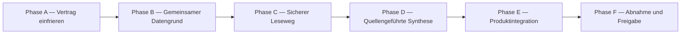

# Etappe 8, Block 2: Roadmap Filmwissen

Stand: 29.07.2026  
Branch: `feat/etappe-8-vorbewertung`

Diese Roadmap ist der verbindliche Bau- und Kommunikationsrahmen für den
gemeinsamen Filmwissens-Cache. Die Phasentitel werden in Chat-Updates,
Dokumentation und Abnahme wortgleich verwendet.

## Statusmeldungen im Chat

Beim Beginn einer Phase:

```text
▶ START: Phase A — Vertrag einfrieren
```

Beim Abschluss derselben Phase:

```text
✓ FERTIG: Phase A — Vertrag einfrieren
```

Für die weiteren Phasen wird ausschließlich Buchstabe und Titel aus der
folgenden Roadmap eingesetzt.

## Roadmap



## Phase A — Vertrag einfrieren

Ziel: Den übergroßen ersten Steckbrief auf einen ausführbaren MVP reduzieren,
ohne offene Rechte- oder Produktfragen still zu entscheiden.

Ergebnisse:

- Block 1 bleibt unverändert und führt keine Webrecherche aus.
- WARUM bleibt bei fehlendem veröffentlichtem Filmwissen `null`.
- Gemeinsames Filmwissen enthält Werkidentität, veröffentlichte Version,
  kurze belegte Einordnung und Fundstellen.
- Die erste Implementierung verwendet keine ungeklärte Website.
- Quellen sind standardmäßig gesperrt und werden einzeln freigegeben.
- Bestehender KI-Budgetwächter bleibt maßgeblich; zusätzlich gilt eine
  Höchstreservierung pro Syntheseauftrag.
- Neue Vorschläge wie die Abschaffung des Passungswerts sind nicht Bestandteil
  dieses Blocks, solange Max sie nicht ausdrücklich entscheidet.

Fertig, wenn:

- ein kurzer technischer Vertrag und die Nicht-Ziele feststehen,
- Daten- und Vertrauensgrenzen benannt sind,
- Tests und Migrationen aus diesem Vertrag ableitbar sind.

## Phase B — Gemeinsamer Datengrund

Ziel: Einen gemeinsamen, accountunabhängigen und fail-closed geschützten
Filmwissensspeicher schaffen.

Ergebnisse:

- kanonische Werkidentität mit kontrollierten Suchschlüsseln,
- fail-closed Quellenregister,
- unveränderliche veröffentlichte Filmwissensversionen,
- atomarer Zeiger auf die aktuelle Version,
- RLS und Rechte: Konten dürfen nur freigegebenes Wissen lesen; weder Konten
  noch Gäste dürfen gemeinsame Daten schreiben,
- kontrollierter Service-Role-Pfad für spätere Veröffentlichung,
- Migrationstests und echte RLS-Gegenprüfung vor Freigabe.

Fertig, wenn:

- ein Cache-Miss keine Daten erzeugt,
- ein Konto keine Quelle, Version oder Werkidentität manipulieren kann,
- frühere Versionen unverändert bleiben und ein Rollback möglich ist.

## Phase C — Sicherer Leseweg

Ziel: Gemeinsames Wissen in der Browser-App streng geprüft und ohne Vermischung
mit persönlichen Daten lesen.

Ergebnisse:

- zentrales Clientmodell mit exakter Schema- und URL-Prüfung,
- angemeldeter, tokengebundener Supabase-Lesepfad,
- ehrliche Zustände `belegt`, `nicht_belegt`, `anmeldung_noetig`,
  `voruebergehend_nicht_verfuegbar`,
- Abruf nur auf ausdrückliche Ansicht oder gebündelt, nicht als unkontrollierter
  Request pro Filmkarte,
- keine Konto-ID, Bewertung, Notiz oder Profildaten im gemeinsamen Cache.

Fertig, wenn:

- manipulierte Serverantworten quarantänisiert werden,
- Demo- und Konto-Daten nicht vermischt werden,
- Offline- und Cache-Miss-Zustände unterscheidbar bleiben.

## Phase D — Quellengeführte Synthese

Ziel: Aus bereits erlaubten, übergebenen Fundstellen einen belegten
WARUM-Vorschlag erzeugen, ohne offene Websuche oder ungeklärtes Scraping.

Ergebnisse:

- geschützter KI-Task für genau ein Werk und eine überschaubare Belegmenge,
- Modellalias, Promptversion, Tokenbudget und Kostenprotokoll,
- geschlossenes Structured-Output-Schema,
- jede Aussage verweist auf eine vorhandene Fundstellen-ID,
- Serverprüfung für Identität, Wertebereich, Belegbezug und Textgrenzen,
- keine Veröffentlichung bei Widerspruch, fremder Quelle oder unmessbaren
  Kosten,
- externe Recherche bleibt deaktiviert, bis mindestens eine Quelle einen
  dokumentierten erlaubten Zugangsweg besitzt.

Fertig, wenn:

- Mocks alle Sicherheits- und Kostenpfade abdecken,
- ohne freigegebene Fundstellen kein Anbieteraufruf beginnt,
- Modellwissen nie als Quelle behandelt wird.

## Phase E — Produktintegration

Ziel: Belegtes gemeinsames Wissen verständlich anzeigen und später kontrolliert
mit der persönlichen Prognose verbinden.

Ergebnisse:

- kompakte Filmwissensanzeige mit WARUM, Sicherheit, Stand und Quellenlinks,
- aufgeklappte Belegansicht mit eigenen Paraphrasen statt Artikelvolltext,
- sichtbarer Cache-Miss ohne erfundene Zahl,
- getrennte Schaltfläche für einen späteren Recherchebericht,
- Block-1-Prognose startet nie still Recherche,
- eigene, versionierte Entscheidung vor der Übernahme von WARUM in
  `film-prognose-v1`.

Fertig, wenn:

- Filmwissen und persönliche Bewertung optisch und technisch getrennt sind,
- dieselbe veröffentlichte Fassung accountübergreifend gelesen wird,
- Rücknahme einer Version keine historische Prognose umschreibt.

## Phase F — Abnahme und Freigabe

Ziel: Den Block gegen Datenlecks, Quellenfehler, Kostenüberschreitung und
Produktvermischung abnehmen.

Ergebnisse:

- komplette Mock-, Function-, Build- und RLS-Suite,
- adversarialer Test mit Remake, gleichem Titel, falschem Jahr,
  Quellenkonflikt und manipulierten URLs,
- budgetgeschützte echte KI-Probe ausschließlich über die erlaubten
  npm-Befehle,
- Staging-Deploy und manuelle Kontoabnahme,
- Migrations- und Kostenprotokoll,
- Entscheidung, welche Restpunkte vor Produktion oder erst in einem späteren
  Rechercheblock gelöst werden.

Fertig, wenn:

- alle Abnahmekriterien belegt sind,
- keine ungeklärte Quelle produktiv aktiviert ist,
- Max den Staging-Stand freigibt.

## Derzeit bewusste Restpunkte

- erste freigegebene Website beziehungsweise API,
- endgültige einfache Skalenanker für WARUM 0 bis 5,
- verbindliche Film-Prüfliste,
- Berechtigung für redaktionelle Zweifelsfälle,
- Integration des veröffentlichten WARUM-Werts in eine spätere
  Prognoseformat-Version.
