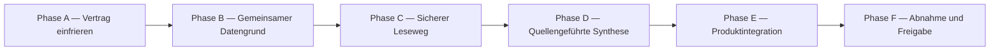

# Etappe 8, Block 2: Roadmap Filmwissen

Stand: 30.07.2026
Branch: `feat/etappe-8-vorbewertung`

Diese Roadmap ist der verbindliche Bau- und Kommunikationsrahmen für den
gemeinsamen Filmwissens-Cache. Die Phasentitel werden in Chat-Updates,
Dokumentation und Abnahme wortgleich verwendet.

Status: **Phasen A bis F am 30.07.2026 technisch abgeschlossen.** Die
budgetgeschützte echte Kette P1–P21 und der finale Staging-Workflow
`30579041676` sind grün. Vor einem Merge nach `main` bleibt nur die bewusste
Staging-Kontoabnahme durch Max.

## Statusmeldungen im Chat

Beim Beginn einer Phase:

```text
▶ START: Phase A — Vertrag einfrieren
```

Beim Abschluss derselben Phase:

```text
✓ FERTIG: Phase A — Vertrag einfrieren
```

Für die weiteren Phasen wird ausschließlich Buchstabe und Titel aus der
folgenden Roadmap eingesetzt.

## Roadmap



## Phase A — Vertrag einfrieren

Status: abgeschlossen.

Ziel: Den übergroßen ersten Steckbrief auf einen ausführbaren MVP reduzieren,
ohne offene Rechte- oder Produktfragen still zu entscheiden.

Ergebnisse:

- Block 1 führt keine Webrecherche aus.
- WARUM darf dort als persönliche Sonnet-Schätzung entstehen; der gemeinsame
  Cache akzeptiert weiterhin nur belegtes WARUM.
- Gemeinsames Filmwissen enthält Werkidentität, veröffentlichte Version,
  kurze belegte Einordnung und Fundstellen.
- Die erste Implementierung verwendet keine ungeklärte Website.
- Quellen sind standardmäßig gesperrt und werden einzeln freigegeben.
- Bestehender KI-Budgetwächter bleibt maßgeblich; zusätzlich gilt eine
  Höchstreservierung pro Syntheseauftrag.
- Neue Vorschläge wie die Abschaffung des Passungswerts sind nicht Bestandteil
  dieses Blocks, solange Max sie nicht ausdrücklich entscheidet.

Fertig, wenn:

- ein kurzer technischer Vertrag und die Nicht-Ziele feststehen,
- Daten- und Vertrauensgrenzen benannt sind,
- Tests und Migrationen aus diesem Vertrag ableitbar sind.

## Phase B — Gemeinsamer Datengrund

Status: abgeschlossen.

Ziel: Einen gemeinsamen, accountunabhängigen und fail-closed geschützten
Filmwissensspeicher schaffen.

Ergebnisse:

- kanonische Werkidentität mit kontrollierten Suchschlüsseln,
- fail-closed Quellenregister,
- unveränderliche veröffentlichte Filmwissensversionen,
- atomarer Zeiger auf die aktuelle Version,
- RLS und Rechte: Konten dürfen nur freigegebenes Wissen lesen; weder Konten
  noch Gäste dürfen gemeinsame Daten schreiben,
- kontrollierter Service-Role-Pfad für spätere Veröffentlichung,
- Migrationstests und echte RLS-Gegenprüfung vor Freigabe.

Fertig, wenn:

- ein Cache-Miss keine Daten erzeugt,
- ein Konto keine Quelle, Version oder Werkidentität manipulieren kann,
- frühere Versionen unverändert bleiben und ein Rollback möglich ist.

## Phase C — Sicherer Leseweg

Status: abgeschlossen.

Ziel: Gemeinsames Wissen in der Browser-App streng geprüft und ohne Vermischung
mit persönlichen Daten lesen.

Ergebnisse:

- zentrales Clientmodell mit exakter Schema- und URL-Prüfung,
- angemeldeter, tokengebundener Supabase-Lesepfad,
- ehrliche Zustände `belegt`, `nicht_belegt`, `anmeldung_noetig`,
  `voruebergehend_nicht_verfuegbar`,
- Abruf nur auf ausdrückliche Ansicht oder gebündelt, nicht als unkontrollierter
  Request pro Filmkarte,
- keine Konto-ID, Bewertung, Notiz oder Profildaten im gemeinsamen Cache.

Fertig, wenn:

- manipulierte Serverantworten quarantänisiert werden,
- Demo- und Konto-Daten nicht vermischt werden,
- Offline- und Cache-Miss-Zustände unterscheidbar bleiben.

## Phase D — Quellengeführte Synthese

Status: abgeschlossen.

Ziel: Aus bereits erlaubten, übergebenen Fundstellen einen belegten
WARUM-Vorschlag erzeugen, ohne offene Websuche oder ungeklärtes Scraping.

Ergebnisse:

- geschützter KI-Task für genau ein Werk und eine überschaubare Belegmenge,
- Modellalias, Promptversion, Tokenbudget und Kostenprotokoll,
- geschlossenes Structured-Output-Schema,
- jede Aussage verweist auf eine vorhandene Fundstellen-ID,
- Serverprüfung für Identität, Wertebereich, Belegbezug und Textgrenzen,
- keine Veröffentlichung bei Widerspruch, fremder Quelle oder unmessbaren
  Kosten,
- externe Recherche bleibt deaktiviert, bis mindestens eine Quelle einen
  dokumentierten erlaubten Zugangsweg besitzt.

Fertig, wenn:

- Mocks alle Sicherheits- und Kostenpfade abdecken,
- ohne freigegebene Fundstellen kein Anbieteraufruf beginnt,
- Modellwissen nie als Quelle behandelt wird.

Abnahmestand 30.07.2026:

- Der bestehende `ai-task` besitzt den deployten, fail-closed
  Vorbereitungspfad `filmwissen-synthese`; der Browser darf ausschließlich
  eine starke Kennung senden.
- Ohne serverseitig beschaffte Fundstellen endet der Pfad vor KI-Reservierung,
  Protokollzeile und Anbieter. Ein unerwartetes `bereit` wird ebenfalls
  gestoppt.
- Eine service-only Fehlerabschluss-RPC verhindert, dass ein gescheiterter
  Rechercheauftrag ein Werk dauerhaft blockiert.
- Der Synthesevertrag nutzt die gemeinsame Providernaht und verlangt exakt
  fünf Ausgabefelder. Eine ausdrückliche institutionelle Einordnung darf den
  WARUM-Wert allein tragen; sonst sind zwei unabhängige verantwortete Quellen
  nötig. Reine Strukturquellen zählen nicht als kulturelle Einordnung.
- Die festen Adapter `wikidata-action-v1` und `loc-nfr-listing-v1` sind
  implementiert und mit Mocks abgesichert. Sie erlauben weder freie URLs noch
  Titelsuche als Identitätsersatz, folgen keinen Redirects und stoppen bei
  falschem Inhaltstyp, Übergröße, Timeout, Rate-Limit oder Schemaabweichung.
- Wikidata löst QID, IMDb- oder TMDB-Kennung ausschließlich über die offizielle
  Action API auf und übernimmt nur einen engen Satz strukturierter Fakten.
- LOC lädt ausschließlich die vollständige offizielle Registry-Tabelle,
  validiert den gesamten Snapshot und ordnet einen Film nur über die zuvor
  Wikidata-geprüfte Identität mit exaktem Titel und Erscheinungsjahr zu.
- Genau die beiden Adapter sind in Produktion freigegeben. Die öffentliche
  Wikimedia-Kontaktangabe ist serverseitig gesetzt. Browserdaten können weder
  Quelle noch freie URL oder Fundstelle vorgeben.
- Der Datenbank-Unterbau besitzt nun einen Reaper für verwaiste Aufträge,
  ein quellenweites Minutenlimit, unveränderliche Herkunftsgruppen und einen
  harten Task-Deckel. Seit der konservativen Preisvorziehung vom 08.08.2026
  beträgt er 6 US-Cent; Modellalias `gross` und 2048 Ausgabetokens sind
  fail-closed hinterlegt.
- Erfolgreiche Publikation und Abschluss des exakt zugeordneten KI-Protokolls
  erfolgen über eine gemeinsame Transaktion. Auch der Fehlerabschluss nach
  einem Anbieteraufruf schließt beide Aufträge zusammen und erhält unbekannte
  Kosten als Reservierung.
- Die Belegklasse wird serverseitig unveränderlich mitgespeichert: Wikidata
  ist `strukturiert`, LOC/National Film Registry `institutionell`; unbekannte
  Quellen bleiben bis zur Prüfung konservativ `strukturiert`.
- Europeana bleibt ein späterer Metadatenkandidat und ist nicht Teil des ersten
  Adapterpaars.
- Guardian bleibt bis zu einem Commercial-Vertrag gesperrt; IMDb, Rotten
  Tomatoes und film.at bleiben ohne schriftliche Lizenz gesperrt.
- Atomare Vorbereitung, gemeinsamer service-only LOC-Snapshot und die
  Einbindung in die bestehende Providernaht sind umgesetzt. Die echte Probe
  veröffentlichte eine Version für `Alien` und traf sie im Folgeaufruf ohne
  Anbieter- oder Quellenkosten erneut.

## Phase E — Produktintegration

Status: abgeschlossen.

Ziel: Belegtes gemeinsames Wissen verständlich anzeigen und kontrolliert mit
der persönlichen Prognose verbinden.

Ergebnisse:

- kompakte Filmwissensanzeige mit WARUM, Sicherheit, Stand und Quellenlinks,
- aufgeklappte Belegansicht mit eigenen Paraphrasen statt Artikelvolltext,
- sichtbarer Cache-Miss ohne erfundene Zahl,
- getrennte Schaltfläche für den ausdrücklich ausgelösten Filmwissensbericht,
- Block-1-Prognose startet nie still Recherche,
- exakte, klar gekennzeichnete Übernahme von belegtem WARUM und
  Filmwissensversions-ID in die persönliche Prognose, ohne Übernahme in echte
  Bewertung oder Rückwirkung auf den gemeinsamen Cache.

Fertig, wenn:

- Filmwissen und persönliche Bewertung optisch und technisch getrennt sind,
- dieselbe veröffentlichte Fassung accountübergreifend gelesen wird,
- Rücknahme einer Version keine historische Prognose umschreibt.

## Phase F — Abnahme und Freigabe

Status: technisch abgeschlossen; bewusste Staging-Kontoabnahme vor Merge
offen.

Ziel: Den Block gegen Datenlecks, Quellenfehler, Kostenüberschreitung und
Produktvermischung abnehmen.

Ergebnisse:

- komplette Mock-, Function-, Build- und RLS-Suite,
- adversarialer Test mit Remake, gleichem Titel, falschem Jahr,
  Quellenkonflikt und manipulierten URLs,
- budgetgeschützte echte KI-Probe ausschließlich über die erlaubten
  npm-Befehle,
- Staging-Deploy und manuelle Kontoabnahme,
- Migrations- und Kostenprotokoll,
- Entscheidung, welche Restpunkte vor Produktion oder erst in einem späteren
  Rechercheblock gelöst werden.

Fertig, wenn:

- alle Abnahmekriterien belegt sind,
- keine ungeklärte Quelle produktiv aktiviert ist,
- Max den Staging-Stand freigibt.

## Bewusst spätere Erweiterungen

- weitere Quellen erst nach dokumentierter Rechte- und Adapterprüfung,
- redaktioneller Korrekturweg für Zweifelsfälle,
- zusätzliche Testwerke jenseits des technischen Kettenbeweises,
- automatische Neuberechnung persönlicher Prognosen nach einer neuen
  Filmwissensversion,
- breiter Filmwissensbericht über WARUM hinaus.
